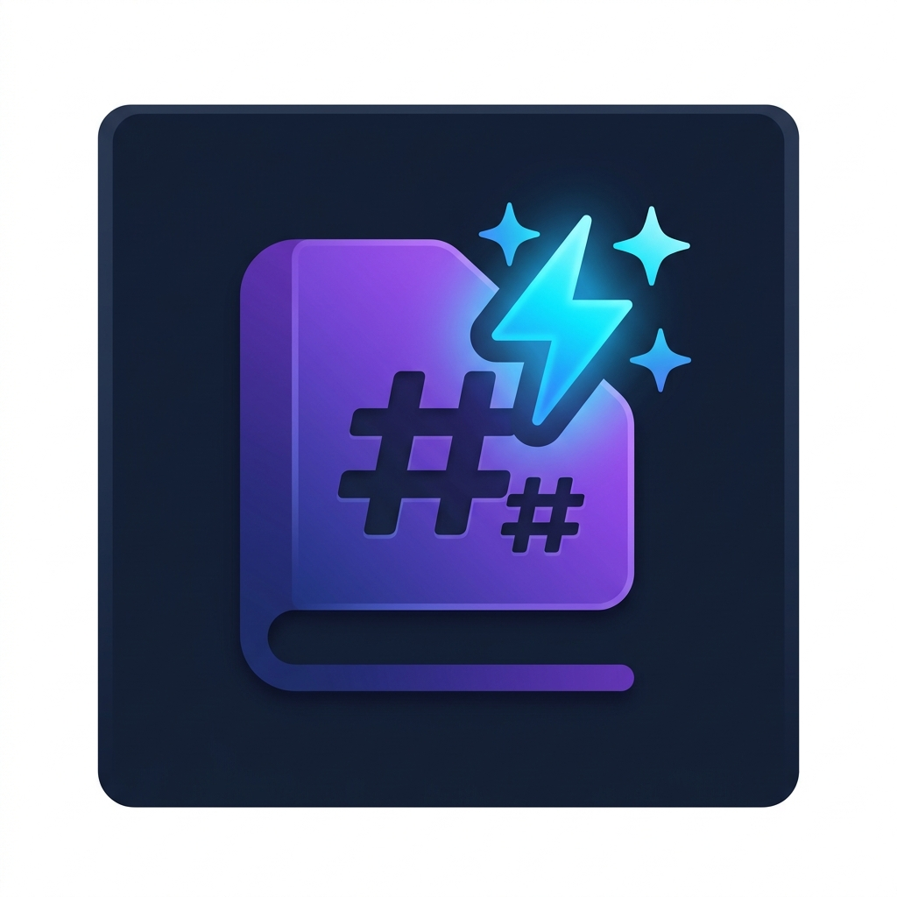

<div align="center">



# Live Readme Studio

[](https://marketplace.visualstudio.com/items?itemName=mehaksandhudev.live-readme-studio)
[](https://open-vsx.org/extension/mehaksandhudev/live-readme-studio)
[](https://hub.docker.com/repository/docker/mehakxsandhu/live-readme)
[](LICENSE)
[](https://live-readme.mehak-sandhu.in)
[](https://buymeacoffee.com/mehaksandhudev)

**An interactive GFM Markdown editor, Shields.io badge builder, and VS Code webview simulator — all in one panel.**  
Available as a VS Code extension, web app, and Docker image.

</div>

---

## 📑 Table of Contents

- [✨ Features](#-features)
- [🖥️ Tech Stack](#️-tech-stack)
- [🚀 Quick Start](#-quick-start)
  - [Web App](#option-a-web-app-no-install)
  - [VS Code Extension](#option-b-vs-code-extension)
  - [Docker](#option-c-docker)
  - [Build from Source](#option-d-build-from-source)
- [📁 Project Structure](#-project-structure)
- [🛠️ Development](#️-development)
- [📦 Packaging & Publishing](#-packaging--publishing)
- [🤝 Contributing](#-contributing)
- [👩‍💻 Author](#-author)
- [📄 License](#-license)

---

## ✨ Features

- **Live GFM Markdown Editor** — Split-panel editor with real-time GitHub-accurate preview and sync scrolling
- **Shields.io Badge Builder** — 3000+ brand icons via Simple Icons, live SVG preview, one-click copy in Markdown / URL / HTML formats
- **VS Code Bridge Studio** — Simulates `postMessage` communication between VS Code editor and webview panels
- **Document Analytics** — Live word count, reading time, checklist completion percentage
- **Document Outline** — Sidebar navigator for H1–H3 headers
- **Toolbar Shortcuts** — Bold, Italic, Link, Image, Table, Code, Checklist, List
- **Emoji Shortcodes** — `:rocket:` → 🚀, `:fire:` → 🔥
- **Drag & Drop** — Drop any `.md` file directly into the panel to load it
- **Syntax Highlighting** — Code blocks highlighted via highlight.js (GitHub theme)
- **GFM Task Lists** — Checkbox rendering for `- [ ]` and `- [x]`

---

## 🖥️ Tech Stack

| Layer | Technology |
|---|---|
| **Framework** | React 19 + TypeScript |
| **Build Tool** | Vite 6 |
| **Styling** | Tailwind CSS v4 |
| **Extension Build** | esbuild |
| **Markdown** | marked + highlight.js |
| **Icons** | Lucide React + Simple Icons |
| **Web Server** | Nginx (Docker) |
| **Deployment** | Vercel (web) · VS Code Marketplace · Open VSX · Docker Hub |

---

## 🚀 Quick Start

### Option A: Web App (No Install)

Visit directly in your browser:

```
https://live-readme.mehak-sandhu.in
```

---

### Option B: VS Code Extension

**From VS Code Marketplace:**

Search **"Live Readme"** in the Extensions panel (`Ctrl+Shift+X`) or install via CLI:

```bash
code --install-extension mehaksandhudev.live-readme-studio
```

**From Open VSX (Antigravity IDE / VSCodium):**

Search **"Live Readme"** in the Extensions panel, or:

```bash
ovsx get mehaksandhudev.live-readme-studio
```

**Usage:**

1. Open any `.md` file in VS Code
2. Press `Ctrl+Shift+P` → **"Live Readme: Open Interactive Preview"**
3. The panel opens in split view beside your file

---

### Option C: Docker

```bash
# Pull and run the web UI
docker pull mehakxsandhu/live-readme:latest
docker run -p 8080:80 mehakxsandhu/live-readme:latest
```

Then open [http://localhost:8080](http://localhost:8080)

---

### Option D: Build from Source

```bash
# Clone the repo
git clone https://github.com/mehaksandhudev/live-readme.git
cd live-readme

# Install dependencies
npm install

# Start local dev server (web UI on port 5173)
npm run dev

# Build everything (web UI + VS Code extension)
npm run build

# Build only the web UI
npm run build:web

# Build only the VS Code extension bundle
npm run build:extension
```

---

## 📁 Project Structure

```
live-readme/
├── src/
│   ├── extension.ts              # VS Code extension entry point
│   ├── main.tsx                  # React app entry point
│   ├── App.tsx                   # Root component + layout
│   ├── index.css                 # Global styles (Tailwind)
│   ├── vite-env.d.ts             # Vite type declarations
│   └── components/
│       ├── BadgeBuilder.tsx      # Shields.io badge builder
│       ├── MarkdownPreview.tsx   # GFM live editor + preview
│       └── VSCodeSimulator.tsx   # VS Code webview bridge simulator
├── assets/
│   └── icon.png                  # 128×128 extension icon
├── .github/
│   └── workflows/
│       ├── docker-publish.yml    # Auto-publish Docker image on tag
│       └── vsce-publish.yml      # Auto-publish to Marketplace + Open VSX on tag
├── Dockerfile                    # Multi-stage Docker build (Vite → Nginx)
├── nginx.conf                    # Nginx SPA config for Docker
├── vercel.json                   # Vercel deployment config
├── vite.config.ts                # Vite config (web + aliases)
├── tsconfig.json                 # TypeScript config
├── package.json                  # Dependencies + npm scripts
├── CHANGELOG.md                  # Version history
└── LICENSE                       # MIT License
```

---

## 🛠️ Development

### Prerequisites
- Node.js `>=18`
- npm `>=9`

### Available Scripts

| Command | Description |
|---|---|
| `npm run dev` | Start Vite dev server at `http://localhost:5173` |
| `npm run build` | Build web UI + VS Code extension bundle |
| `npm run build:web` | Build web UI only → `dist/` |
| `npm run build:extension` | Build extension bundle only → `dist-extension/` |
| `npm run preview` | Preview production build locally |

---

## 📦 Packaging & Publishing

### Package the VS Code Extension (.vsix)

```bash
npm run build
npx vsce package --allow-missing-repository
```

### Publish to VS Code Marketplace (manual)

1. Go to [marketplace.visualstudio.com/manage](https://marketplace.visualstudio.com/manage)
2. Sign in → **+ New extension** → **Visual Studio Code**
3. Drag and drop the generated `.vsix` file

### Publish to Open VSX (Antigravity IDE)

```bash
npx ovsx create-namespace mehaksandhudev -p <your-token>
npx ovsx publish *.vsix -p <your-token>
```

### Auto-publish via GitHub Actions (on version tag)

Add these secrets to your GitHub repository:
- `OVSX_TOKEN` — token from [open-vsx.org/user-settings/tokens](https://open-vsx.org/user-settings/tokens)
- `VSCE_PAT` — Personal Access Token from Azure DevOps (Marketplace scope)

Then tag a release:

```bash
git tag v1.2.0
git push origin main --tags
```

GitHub Actions will automatically build, package, and publish to both stores.

### Build & Push Docker Image

```bash
docker build -t mehakxsandhu/live-readme:latest .
docker push mehakxsandhu/live-readme:latest
```

Or just push a tag — the Docker CI workflow handles it automatically.

---

## 🤝 Contributing

Contributions are welcome! Here's how to get started:

1. **Fork** the repository
2. **Clone** your fork: `git clone https://github.com/your-username/live-readme.git`
3. **Install** dependencies: `npm install`
4. **Create** a feature branch: `git checkout -b feat/your-feature`
5. **Make** your changes and test with `npm run dev`
6. **Commit** with a descriptive message: `git commit -m "feat: add your feature"`
7. **Push** and open a **Pull Request**

Please open an [issue](https://github.com/mehaksandhudev/live-readme/issues) first for major changes.

---

## 👩‍💻 Author

**Mehak Sandhu**

[](https://mehak-sandhu.in)
[](https://github.com/mehaksandhudev)

---

## 📄 License

MIT © [Mehak Sandhu](https://mehak-sandhu.in) — see [LICENSE](LICENSE) for details.
